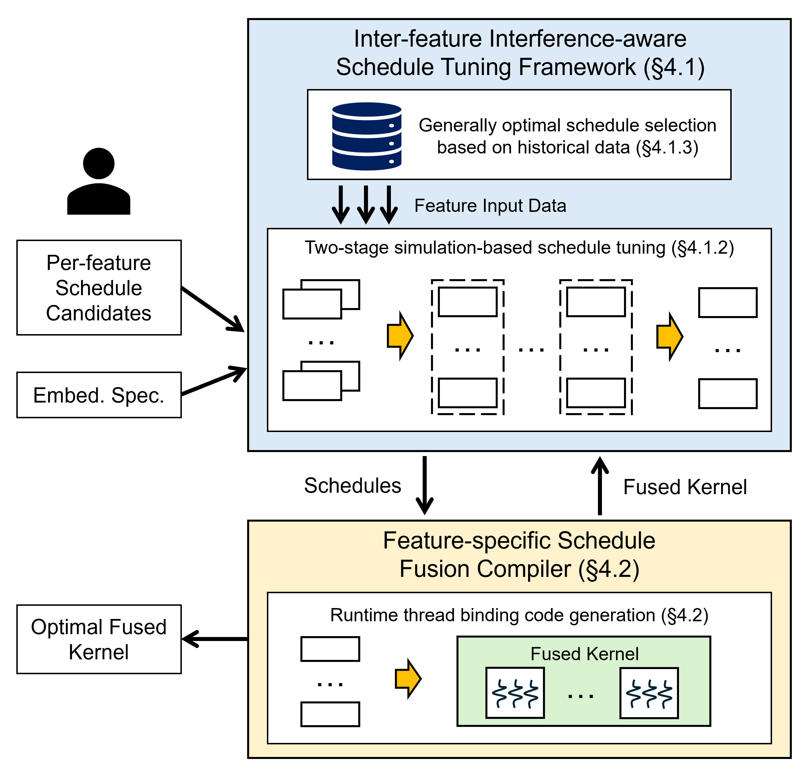

# RecFlex

RecFlex is a recommendation model optimization system that optimizes the GPU kernel of fused embedding operations, allowing using distinct schedules for different feature fields in the fused kernel.

RecFlex utilizes an *inter-feature interference-aware tuning framework* to tune the generally optimal schedules based on recent input data.
It first tunes the per-feature schedule with explicitly controlled occupancy and simulated inter-feature interference in the local stage, and then tunes the optimal occupancy value in the global stage.
RecFlex also incorporates a *feature-specific schedule fusion compiler* to generate fused GPU kernels.
The thread binding of the fused kernels is determined at runtime to reduce workload imbalance and resource waste.

<p align="center">
  
  <p align="center"><b>
  RecFlex Overview.
  </b></p>
</p>

Experimental results show that RecFlex achieves average speedups of 1.95×, 11.57×, and 7.92× over [TorchRec](https://github.com/pytorch/torchrec), [HugeCTR](https://github.com/NVIDIA-Merlin/HugeCTR), and [RECom](https://github.com/AlibabaResearch/recom), which are the state-of-the-art recommendation model libraries or compilers.

## Get Started

### Set up Development Environment

To try RecFlex, you can directly run the docker container with image `nvcr.io/nvidia/pytorch:23.04-py3`.

```bash
docker run -d --gpus all --net=host --name recflex -it nvidia/cuda:11.8.0-cudnn8-devel-ubuntu20.04
```

In our paper, to be compatible with TorchRec, we use the image `nvidia/cuda:11.8.0-cudnn8-devel-ubuntu20.04` and execute the following commands:

```bash
apt-get update

# install python3.8 and pip
apt-get install -y wget python3.8 python3.8-distutils python3.8-dev
wget https://bootstrap.pypa.io/get-pip.py
python3.8 get-pip.py
update-alternatives --install /usr/bin/python python /usr/bin/python3.8 1

# install torch and torchrec
pip install torch==2.2.0 --index-url https://download.pytorch.org/whl/cu118
pip install fbgemm-gpu==0.6.0 --index-url https://download.pytorch.org/whl/cu118
pip install torchmetrics==1.0.3
pip install torchrec==0.6.0 --index-url https://download.pytorch.org/whl/cu118
```

Then, install CMake:

```bash
cd ~
wget https://github.com/Kitware/CMake/releases/download/v3.28.3/cmake-3.28.3-linux-x86_64.tar.gz
tar -zxvf cmake-3.28.3-linux-x86_64.tar.gz
export PATH=$HOME/cmake-3.28.3-linux-x86_64/bin:$PATH
echo 'export PATH=$HOME/cmake-3.28.3-linux-x86_64/bin:$PATH' >> ~/.bashrc
```

and install Nsight System:

```bash
cd ~
wget https://developer.nvidia.com/downloads/assets/tools/secure/nsight-systems/2023_4_1_97/nsight-systems-2023.4.1_2023.4.1.97-1_amd64.deb
apt-get install -y ./nsight-systems-2023.4.1_2023.4.1.97-1_amd64.deb
```

### Install RecFlex

Clone this repository to `RecFlex` and then install the RecFlex package:

```bash
cd RecFlex
pip install .
bash post_install.sh
```

### Run a Simple Test

```bash
cd examples
bash test.sh
```

## Benchmark Models and Datasets

The benchmark models used in the paper are simplified DLRMs with no bottom MLP. The pooling operations used in the models are reduce-sum for all features.
After embedding lookups of all features, the concatenation operation is applied so that the embedding dimension can vary across features.

For the input datasets, we use the script [`data_synthesis/data_generate.py`](data_synthesis/data_generate.py) and the configurations under [`examples/models`](examples/models) to generate them.
See [`data_synthesis/README.md`](data_synthesis/README.md) for details.

## Citation

If you use this codebase or otherwise found our work valuable, please cite:

```bibtex
@inproceedings{pan2024recflex,
  title = {RecFlex: Enabling Feature Heterogeneity-Aware Optimization for Deep Recommendation Models with Flexible Schedules},
  author = {Pan, Zaifeng and Zheng, Zhen and Zhang, Feng and Xie, Bing and Wu, Ruofan and Smith, Shaden and Liu, Chuanjie and Ruwase, Olatunji and Du, Xiaoyong and Ding, Yufei},
  booktitle = {SC24: International Conference for High Performance Computing, Networking, Storage and Analysis},
  year = {2024},
  organization = {IEEE}
}
```
